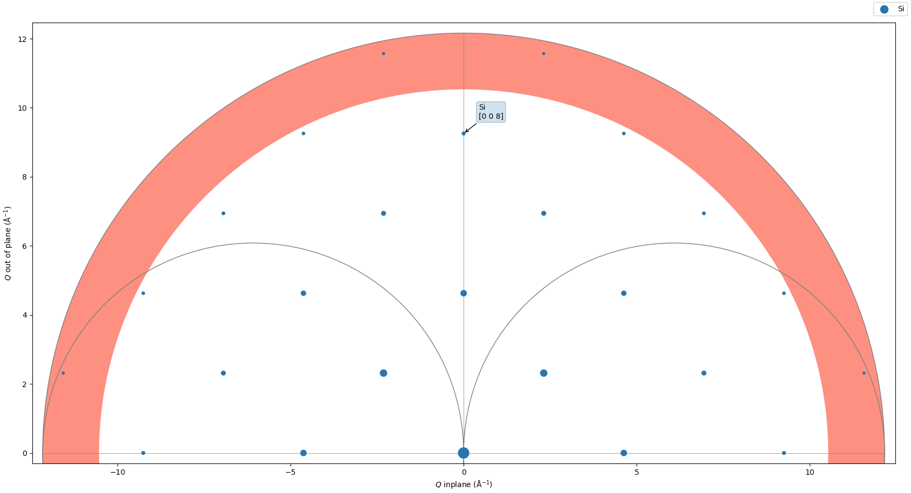

# Diffractometer Angles Finder
## Program still under development in LNLS

## Requirements:

1. xrayutilities
2. numpy
3. scipy; version=1.4.1
4. pandas
5. matplotlib
6. tqdm

## Tutorial

To start using DAF first you'll need to export the command's path, to do so enter in the clonned directory and execute the init.sh script:
```
source init.sh
```
Now check if it went well by typing daf. and pressing tab two times, the result must be like that:

```
daf.
daf.amv     daf.bounds  daf.cons    daf.expt    daf.init    daf.macro   daf.mode    daf.mv      daf.reset   daf.rmap    daf.scan    daf.setup   daf.status  daf.ub      daf.wh 
```

Them you just need to move to a desired directory where you want the data to be generated and use DAF.

First initialize DAF:
```
daf.init -6c
```
All of the functions have a shell-like help option by typing -h or --help, like:

```
daf.expt -h
usage: daf.expt [-h] [-m samp] [-p a b c α β γ] [-i x y z] [-n x y z]
                [-r x y z] [-s or] [-e en]

Describe the experiment inputs

optional arguments:
  -h, --help            show this help message and exit
  -m samp, --Material samp
                        Sets the material that is going to be used in the
                        experiment
  -p a b c α β γ , --Lattice_parameters a b c α β γ 
                        Sets lattice parameters, must be passed if defining a
                        new material
  -i x y z, --IDir x y z
                        Sets the reflection paralel to the incident beam
  -n x y z, --NDir x y z
                        Sets the reflection perpendicular to the incident beam
  -r x y z, --RDir x y z
                        Sets the reference vector
  -s or, --Sampleor or  Sets the sample orientation at Phi axis
  -e en, --Energy en    Sets the energy of the experiment (eV), wavelength can
                        also be given (Å)

Eg: 
    daf.expt --Material Si --Energy 8000
    daf.expt -m Si -e 8000
    daf.expt -s x+ 
    daf.expt -i 1 0 0 -n 0 1 0  
```

Them use the functions daf.expt, daf.mode, daf.bounds, daf.cons, daf.ub in order to define your experiment conditions.

```
daf.expt -m Si -e 12000
daf.expt -m my_sample -p 5.431 5.431 5.431 90 90 90
```
This will set silicon as your sample and energy to 12 keV

```
daf.mode -h
usage: daf.mode [-h] Mode

     >detector<  >Reference<     >Sample<     >Sample<     >Sample<
        g_mode1      g_mode2      g_mode3      g_mode4      g_mode5
0             .            .  omega-fixed            X            X  0
1   Delta-fixed   Alpha=Beta    Eta-fixed    Eta-fixed    Eta-fixed  1
2      Nu-fixed  Alpha-fixed     Mu-fixed     Mu-fixed     Mu-fixed  2
3     Qaz-fixed   Beta-fixed    Chi-fixed    Chi-fixed    Chi-fixed  3
4     Naz-fixed    Psi-fixed    Phi-fixed    Phi-fixed    Phi-fixed  4
5          Zone            X    Eta=Del/2            X            X  5
6             X            X      Mu=Nu/2            X            X  6

positional arguments:
  Mode        Set the operation mode of the diffractometer, following the same
              modes as used in Spec, the mode should be passed without spaces

optional arguments:
  -h, --help  show this help message and exit

Eg:
    daf.mode 215, will set Nu fix, Alpha=Beta, Eta=Del/2
```

To set a mode:

```
daf.mode 215
daf.mode 2052
```

In order to set the bounds limits:

```
daf.bounds -d -180 180 -c -10 100 -l

Mu    =    [-20.0, 160.0]
Eta   =    [-20.0, 160.0]
Chi   =    [-10.0, 100.0]
Phi   =    [-400.0, 400.0]
Nu    =    [-20.0, 160.0]
Del   =    [-180.0, 180.0]

```
Choose a value for the fixed angles in the mode by:


```
daf.cons -n 30 -m 0
```

The orientation matrix can also be calculated by two or three reflections:

```
daf.ub -r1 1 0 0 0 5.28232 0 2 0 10.5647
daf.ub -r2 0 1 0 0 5.28232 2 92 0 10.5647
daf.ub -r3 0 0 1 0 5.28232 92 92 0 10.5647
daf.ub -c3
daf.ub -s

                                                
          │  0.99939    -0.03488      0.00122  │
U    =    │  0.03490     0.99878     -0.03488  │
          │  0.00000     0.03490      0.99939  │

                                                
          │  1.11905    -0.03905      0.00136  │
UB   =    │  0.03908     1.11837     -0.03905  │
          │  0.00000     0.03908      1.11905  │

```

To show all the previous configurations:


```
daf.status -a
                                                                                             
         MODE          nu_fix         α = β          mu_fix           --             --      
        21200           30.0            --            0.0             --             --      

                                                                                             
       Material    WaveLength (Å)  Energy (keV)  Incidence Dir    Normal Dir   Reference Dir 
          Si          1.03320        12.00000     0.0 1.0 0.0    0.0 0.0 1.0    0.0 0.0 1.0  


                                                
          │  0.99939    -0.03488      0.00122  │
U    =    │  0.03490     0.99878     -0.03488  │
          │  0.00000     0.03490      0.99939  │

                                                
          │  1.11905    -0.03905      0.00136  │
UB   =    │  0.03908     1.11837     -0.03905  │
          │  0.00000     0.03908      1.11905  │


Mu    =    [-20.0, 160.0]
Eta   =    [-20.0, 160.0]
Chi   =    [-10.0, 100.0]
Phi   =    [-400.0, 400.0]
Nu    =    [-20.0, 160.0]
Del   =    [-180.0, 180.0]

```

In order to move use daf.amv for angle movement, daf.mv for hkl movement, daf.rmap to move aided by graphical of interface of  the reciprocal space, daf.scan to perform a scan.

Use daf.amv to directly set an angle value, and them daf.wh to see where you are in the hkl coordinates:

```
daf.amv -d 30 -e 15
daf.wh

HKL now =    2.72097 0.00000 0.00000

Alpha   =    0.00000
Beta    =    -0.00000
Psi     =    90.00000
Tau     =    90.00000
Qaz     =    90.00000
Naz     =    -0.00000
Omega   =    0.00000

Mu      =    0.00000
Eta     =    15.00000
Chi     =    0.00000
Phi     =    0.00000
Nu      =    0.00000
Del     =    30.00000

```

Move directly by an hkl with daf.mv:

```
daf.mv 1 1 1 -v

   MODE        nu_fix       α = β       η = δ/2         --           --         Error     
  21500       0.00000         --           --           --           --        6.47e-09   
                                                                                          
    H            K            L        Ref vector   Energy (keV)   WL (Å)       Sample    
 1.00000      1.00000      1.00000     0.0 0.0 1.0   12.39842     1.00000         Si      
                                                                                          
    Qx           Qy           Qz          |Q|         Exp 2θ        Dhkl      FHKL (Base) 
 1.15690      1.15690      1.15690      2.00381      18.35093     3.13561      60.43181   
                                                                                          
  Alpha         Beta         Psi          Tau          Qaz          Naz         Omega     
 5.28232      5.28232      90.00000     54.73563     90.00000     34.91732     -0.00000   
                                                                                          
   Del          Eta          Chi          Phi           Nu           Mu           --      
 18.35093     9.17547      35.26439     45.00000     0.00000      -0.00000        --      


```

Or aided by a graphical interface, where you can point and click in a hkl:

```
daf.rmap
```




To perform a scan from hkl (1 1 1) to hkl (1.1 1.1 1.1), and save it on a csv file called my_scan:

```
daf.scan 1 1 1 1.1 1.1 1.1 10 -n my_scan -v
100%|█████████████████████████████████████████████████████████████████████████████████████████████████████████████████████████████████████████████████████████████████████████████████████████████████████████████████████████████████████████████████████| 11/11 [00:00<00:00, 30.74it/s]
        Mu      Eta      Chi      Phi      Nu      Del       2θ        θ   alpha      qaz      naz      tau      psi    beta    omega                  HKL Calc     Error
0   0.0000   9.4829  35.2644  45.0000  0.0000  18.9657  18.9657   9.4829  5.4582  90.0000  34.8936  54.7356  90.0000  5.4582  -0.0000  [1.0000, 1.0000, 1.0000]  8.74e-08
1   0.0000   9.5786  35.2644  45.0000  0.0000  19.1572  19.1572   9.5786  5.5130  90.0000  34.8861  54.7356  90.0000  5.5130   0.0000  [1.0100, 1.0100, 1.0100]  2.07e-07
2   0.0000   9.6743  35.2644  45.0000  0.0000  19.3487  19.3487   9.6743  5.5677  90.0000  34.8785  54.7356  90.0000  5.5677   0.0000  [1.0200, 1.0200, 1.0200]  1.28e-07
3   0.0000   9.7701  35.2644  45.0000  0.0000  19.5402  19.5402   9.7701  5.6225  90.0000  34.8708  54.7356  90.0000  5.6225   0.0000  [1.0300, 1.0300, 1.0300]  2.48e-07
4   0.0000   9.8659  35.2644  45.0000  0.0000  19.7318  19.7318   9.8659  5.6773  90.0000  34.8630  54.7356  90.0000  5.6773   0.0000  [1.0400, 1.0400, 1.0400]  1.31e-07
5   0.0000   9.9617  35.2644  45.0000  0.0000  19.9235  19.9235   9.9617  5.7320  90.0000  34.8551  54.7356  90.0000  5.7320   0.0000  [1.0500, 1.0500, 1.0500]  2.16e-08
6   0.0000  10.0576  35.2644  45.0000  0.0000  20.1152  20.1152  10.0576  5.7868  90.0000  34.8472  54.7356  90.0000  5.7868   0.0000  [1.0600, 1.0600, 1.0600]  5.88e-08
7   0.0000  10.1535  35.2644  45.0000  0.0000  20.3069  20.3069  10.1535  5.8416  90.0000  34.8392  54.7356  90.0000  5.8416   0.0000  [1.0700, 1.0700, 1.0700]  1.95e-08
8   0.0000  10.2494  35.2644  45.0000  0.0000  20.4988  20.4988  10.2494  5.8964  90.0000  34.8311  54.7356  90.0000  5.8964   0.0000  [1.0800, 1.0800, 1.0800]  7.67e-09
9   0.0000  10.3453  35.2644  45.0000  0.0000  20.6907  20.6907  10.3453  5.9512  90.0000  34.8229  54.7356  90.0000  5.9512   0.0000  [1.0900, 1.0900, 1.0900]  4.42e-08
10  0.0000  10.4413  35.2644  45.0000  0.0000  20.8826  20.8826  10.4413  6.0060  90.0000  34.8147  54.7356  90.0000  6.0060  -0.0000  [1.1000, 1.1000, 1.1000]  7.74e-07

```

You can always return everything to default by using:

```
daf.reset -a
```

And also consult your daf's commands in the log file generated in your currently directory:

```
vi Log
```

If you find any configuration that you liked you can save it as an enviroment:

```
daf.setup -s env_1.0
```
List your enviroments by:

```
daf.setup -l
➤  default
   env_1.0
   env_2.0

```

Change freely between them by:

```
daf.setup -c env_1.0 
```

As daf is runned in terminal, you can use any shell command to interact with it, and also generate macros by shell scripting.

A more consistent documentation is being developed.
