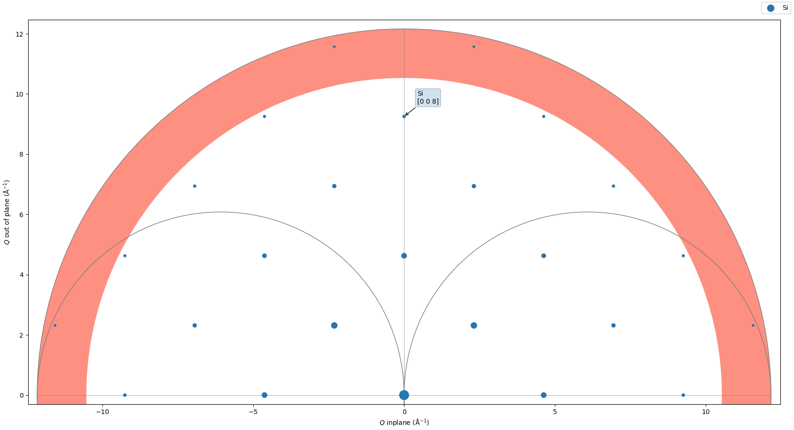

# Diffractometer Angles Finder
## Program under development for emulating Spec

## Requirements:

1. xrayutilities
2. numpy
3. scipy; version=1.4.1
4. pandas
5. tqdm

To start using DAF first you need to export the commands path, to do this enter in the clonned directory anda execute the init.sh script:
```
source init.sh
```
Now check if it went well by typing daf. and pressing tab two times, the result must be like that:

```
daf.
daf.amv     daf.bounds  daf.cons    daf.expt    daf.init    daf.macro   daf.mode    daf.mv      daf.reset   daf.rmap    daf.scan    daf.setup   daf.status  daf.ub      daf.wh 
```

Now you just need to move to a desired directory where you want the data to be generated and use DAF.

First initialize DAF:
```
daf.init -6c
```
All of the functions have a shell-like help option by typing -h or --help, like:

```
daf.expt -h
```

Them use the functions daf.expt, daf.mode, daf.bounds, daf.cons in order to define your experiment conditions.

```
daf.expt -m Si -e 12000
daf.expt -m my_sample -p 5.431 5.431 5.431 90 90 90
```
This will set Silicon as your sample and energy to 12 keV

```
daf.mode -h 

daf.mode -h
usage: daf.mode [-h] Mode

     >detector<  >Reference<     >Sample<     >Sample<     >Sample<
        g_mode1      g_mode2      g_mode3      g_mode4      g_mode5
0             .            .  omega-fixed            X            X  0
1   Delta-fixed   Alpha=Beta    Eta-fixed    Eta-fixed    Eta-fixed  1
2      Nu-fixed  Alpha-fixed     Mu-fixed     Mu-fixed     Mu-fixed  2
3     Qaz-fixed   Beta-fixed    Chi-fixed    Chi-fixed    Chi-fixed  3
4     Naz-fixed    Psi-fixed    Phi-fixed    Phi-fixed    Phi-fixed  4
5          Zone            X    Eta=Del/2            X            X  5
6             X            X      Mu=Nu/2            X            X  6

positional arguments:
  Mode        Set the operation mode of the diffractometer, following the same
              modes as used in Spec, the mode should be passed without spaces

optional arguments:
  -h, --help  show this help message and exit

Eg:
    daf.mode 215, will set Nu fix, Alpha=Beta, Eta=Del/2
```

To set a mode:

```
daf.mode 215
daf.mode 2052
```

In order to set the bounds limits:

```
daf.bounds -d -180 180 -c -10 100 -l

Mu    =    [-20.0, 160.0]
Eta   =    [-20.0, 160.0]
Chi   =    [-10.0, 100.0]
Phi   =    [-400.0, 400.0]
Nu    =    [-20.0, 160.0]
Del   =    [-180.0, 180.0]

```
Choose a value for the fixed angles in the mode by:


```
daf.cons -n 30 -m 0
```

The orientation matrix can also be calculated by two or three reflections:

```
daf.ub -r1 1 0 0 0 5.28232 0 2 0 10.5647
daf.ub -r2 0 1 0 0 5.28232 2 92 0 10.5647
daf.ub -r3 0 0 1 0 5.28232 92 92 0 10.5647
daf.ub -c3
daf.ub -s

                                                
          │  0.99939    -0.03488      0.00122  │
U    =    │  0.03490     0.99878     -0.03488  │
          │  0.00000     0.03490      0.99939  │

                                                
          │  1.11905    -0.03905      0.00136  │
UB   =    │  0.03908     1.11837     -0.03905  │
          │  0.00000     0.03908      1.11905  │

```

To show all the previous configurations:


```
daf.status -a
                                                                                             
         MODE          nu_fix         α = β          mu_fix           --             --      
        21200           30.0            --            0.0             --             --      

                                                                                             
       Material    WaveLength (Å)  Energy (keV)  Incidence Dir    Normal Dir   Reference Dir 
          Si          1.03320        12.00000     0.0 1.0 0.0    0.0 0.0 1.0    0.0 0.0 1.0  


                                                
          │  0.99939    -0.03488      0.00122  │
U    =    │  0.03490     0.99878     -0.03488  │
          │  0.00000     0.03490      0.99939  │

                                                
          │  1.11905    -0.03905      0.00136  │
UB   =    │  0.03908     1.11837     -0.03905  │
          │  0.00000     0.03908      1.11905  │


Mu    =    [-20.0, 160.0]
Eta   =    [-20.0, 160.0]
Chi   =    [-10.0, 100.0]
Phi   =    [-400.0, 400.0]
Nu    =    [-20.0, 160.0]
Del   =    [-180.0, 180.0]

```

To move use daf.amv for angle movement, daf.mv for hkl movement, daf.rmap to see a graphical of the reciprocal space, daf.scan to perform a scan.

Use daf.amv to directly set an angle value, and them daf.wh to see where you are in the hkl coordinates:

```
daf.amv -d 30 -e 15
daf.wh

HKL now =    2.72097 0.00000 0.00000

Alpha   =    0.00000
Beta    =    -0.00000
Psi     =    90.00000
Tau     =    90.00000
Qaz     =    90.00000
Naz     =    -0.00000
Omega   =    0.00000

Mu      =    0.00000
Eta     =    15.00000
Chi     =    0.00000
Phi     =    0.00000
Nu      =    0.00000
Del     =    30.00000

```

Move directly by an hkl with daf.mv:

```
daf.mv 1 1 1 -v
                                                                                          
   MODE        nu_fix         --        η = δ/2       mu_fix         --         Error     
  20520       0.00000         --           --        0.00000         --        1.93e-05   
                                                                                          
  Exp 2θ        Dhkl      Energy (keV)     H            K            L          Sample    
 18.96562     3.13561      12.00000     0.99998      1.00000      1.00000       Si z+     
                                                                                          
  Alpha         Beta         Psi          Tau          Qaz          Naz         Omega     
 5.45823      5.45815      90.00005     54.73561     90.00000     34.89391     -0.00000   
                                                                                          
   Del          Eta          Chi          Phi           Nu           Mu           --      
 18.96562     9.48281      35.26468     45.00034     0.00000      0.00000         --      

```

Or aided by a graphical interface, where you can point and click in a hkl:

```
daf.rmap
```



A more consistent documentation is being developed.
